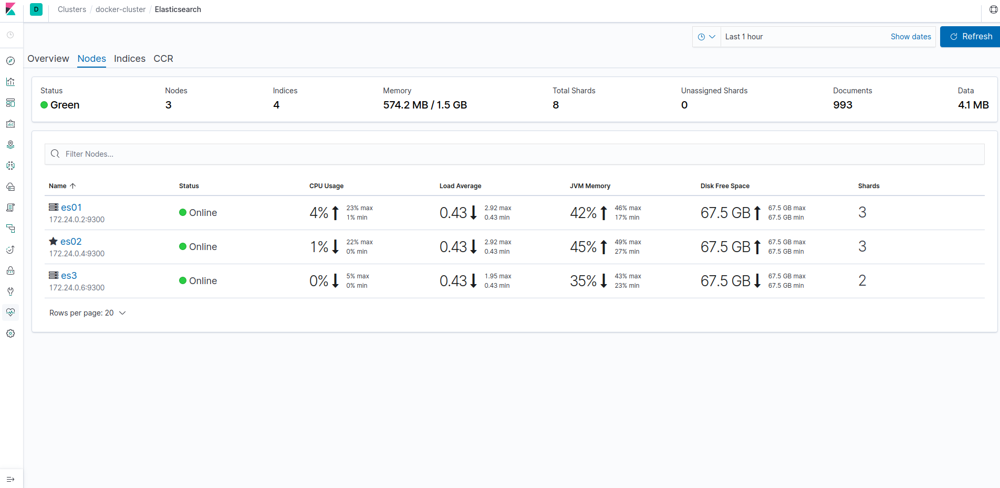
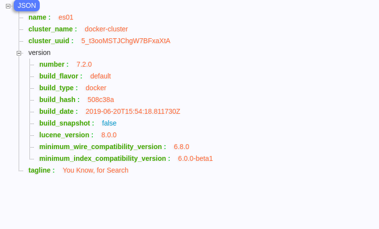

# Elasticsearch + Logstash + Kibana Stack
Run the the ELK (Elasticsearch, Logstash, Kibana) stack with Docker and Docker Compose.
All docker images is provided at [here](https://www.docker.elastic.co/).

## Host setup

By default, the stack exposes the following ports:
- 5000: Logstash TCP input
- 9200: Elasticsearch HTTP
- 9300: Elasticsearch TCP transport
- 5601: Kibana
- 5000: Elasticsearch HQ
- file beat

## Setup
```sh
> git clone git@github.com:Jimmea/docker-elastic-7x.git /path_to_project

> cd /path_to_project

# Cài đặt các version 6x
> sh install_6x.sh

# Cài đặt các version 7x
> sh install_7x.sh

> docker-compose logs -f


> docker-compose down
```

**Note important**: If you using Ubuntu/Linux, you may need to change the permissions of folder:

```sh
sudo chmod -R 777 /path_to_project/data
```

**Copy config elasticsearch.yaml from container to host|local**
```
docker cp [name_container]:/usr/share/elasticsearch/config/elasticsearch.yml source/elasticsearch.yml
```

## Upgrade or Down
```
    Update file .env for specify version
    docker-compose -f docker-compose.yml up -d
    
```


## Securing Kibana with nginx basic auth
If you dont have subscription for elasticsearch there is a better chance your elastic kibana setup for web development is suspectable to attacks with advent of shodan and ransomware its quiet easy these days some b


Syntax: Add service to `docker-compose.yaml`
```
nginx:
    image: quay.io/dtan4/nginx-basic-auth-proxy:latest
    ports:
      - 8080:80
      - 8090:8090
    environment:
      - BASIC_AUTH_USERNAME
      - BASIC_AUTH_PASSWORD
      - PROXY_PASS=http://kibana:5601/
    networks: 
      - kibana
```
#### Environment variables

Now next steps are to configure user name and pass by creating `.env` file in same directory with following contents.  

|Key|Description|
|---|---|
|`BASIC_AUTH_USERNAME`|Basic auth username|
|`BASIC_AUTH_PASSWORD`|Basic auth password|

> After everything is up and running visit http://localhost:8080 to access kibana .

#### Endpoint for monitoring
:8090/nginx_status returns the metrics of Nginx.
```
$ curl localhost:8090/nginx_status
Active connections: 1
server accepts handled requests
 8 8 8
Reading: 0 Writing: 1 Waiting: 0

```

## Accessing Kibana
Kibana is a web application that you access through port 5601. Go to url: http://localhost:5601 with login information:
```
Username: elastic
Password: elastic
```





## Issue Note
- When memory host contain volumn low. Docker kibana automatically down.

## Exploring Your Cluster
Using cURL in the [Console](http://localhost:5601/app/kibana#/dev_tools/console?_g=()) to:

## References:
- [Elasticsearch start docker](https://www.elastic.co/guide/en/elastic-stack-get-started/current/get-started-docker.html)
- [Elasticsearch Document](https://www.elastic.co/guide/en/elasticsearch/reference/current/index.html)
- [Kibana Document](https://www.elastic.co/guide/en/kibana/current/index.html)
- [Logstash Document](https://www.elastic.co/guide/en/logstash/current/index.html)
- [Install Elasticsearch with Docker](https://www.elastic.co/guide/en/elasticsearch/reference/current/docker.html)
- [The Search API](https://www.elastic.co/guide/en/elasticsearch/reference/current/_the_search_api.html)
- [Sending Docker Logs to ElasticSearch and Kibana with FileBeat](https://www.sarulabs.com/post/5/2019-08-12/sending-docker-logs-to-elasticsearch-and-kibana-with-filebeat.html)
- [Authenticate kibana with nginx](https://documentation.wazuh.com/3.7/installation-guide/optional-configurations/kibana_ssl.html)
- [Authenticate kibana tutorial](http://codingfundas.com/setting-up-elasticsearch-6-8-with-kibana-and-x-pack-security-enabled/index.html)
